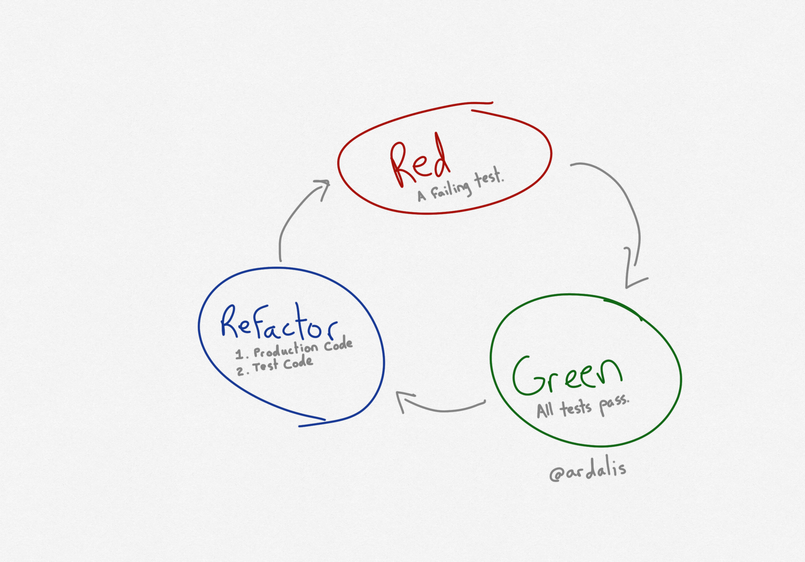

Red, Green, Refactor is a practice used during [Test-Driven Development (TDD)](/practices/test-driven-development). It reflects the state of a new test failing, making that test pass, and then considering whether the existing solution can be improved through refactoring.

## Red - Write a failing test

In TDD, everything starts with a failing test. You write the test first so that you know when to stop writing the code for this micro-step of the overall process. That's what *driven* means in Test-Driven Development. The tests *drive* the writing of the production code by providing you with an immediate goal.

Each test poses a *hypothesis* about how the system *should* or *might* work. Unlike science, which has only one world in which to run experiments, with one set of rules, tests run against software systems that can be constantly changed. So, a hypothesis that turns out to be false in one version of the software, may be true in future versions (and may become false again if there is a regression!).

Most test runners render failing tests in red, hence the use of the color to represent the state of having a failing test. Also, it's very important that each test be run - and shown to fail - before the code it is testing is implemented. It's entirely too easy to write a test that cannot fail, or that doesn't actually test what you think it does, so seeing it fail *and then pass only due to expected changes in the system it's testing* is crucial.

## Green - Make the test pass

Make the test pass, as simply as possible, and then stop. Avoid the temptation to write more code, to anticipate future needs (see [YAGNI](/principles/yagni)), or to further generalize or optimize.

One of the key benefits of TDD is that it reduces the amount of code one must write in order to satisfy the requirements of the system. Less code written means less time spent writing code, as well as less time maintaining and debugging that extra code. In this way, using TDD is a way to apply lean principles to one's software.

Once you've written a failing test and then made it pass, it's a good time to make a commit, at least locally.

## Refactor - If warranted

[Refactoring](/practices/refactoring) is the process of changing the design of code without changing its (external) behavior. You should only refactor when all of your tests are green - that way you'll be certain any tests that break after your refactoring are because you screwed up, not because the system was already broken beforehand.

It's a good idea to commit after each refactoring step, especially if you didn't already do so before refactoring. Even though the TDD cycle may have you working in very small increments of 5-10 minutes per test, it's still worthwhile to add a local commit per test, so that if you ever find that you've gone down the wrong path, you don't lose too much progress by reverting to an earlier commit. Remember the Turkish proverb, "No matter how far down the wrong path you've gone, turn back now."

Another useful practice to remember during the refactoring stage is to refactor either the test code, or the system under test (SUT) code, but not both, between commits. This will keep your commits smaller and will ensure that your tests act as a check on your changes to the SUT, and your SUT acts as a check on your test code as well.

Finally, remember that refactoring is an optional step. If you're making good progress and refactoring is only going to slow you down, it's often a good idea to keep going for another test case or two. But then take a moment to really look at what you've produced, and see if it can't be simplified or otherwise improved.

## Quotes

"No matter how far down the wrong path you've gone, turn back now" -- Turkish Proverb

## References

- [RGRC is the New Red Green Refactor for Test-First Development](https://ardalis.com/rgrc-is-the-new-red-green-refactor-for-test-first-development/)
- [Test Driven Development by Example (Kent Beck)](https://amzn.to/3xVBR7Q)
- [Code That Fits in Your Head (Mark Seeman)](https://amzn.to/3xTL8NO)