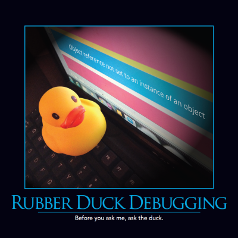

Sometimes the process of describing a problem, even to an inanimate object, can reveal the solution. Rubber duck debugging refers to the practice of using a small toy, like a rubber duck, as your first assistant when you are faced with a bug in your application. Before asking one of your peers, carefully explain the problem to the rubber duck (out loud, ideally). There's something magical about stating your problems aloud that often makes the solution more clear.

## Quotes

https://twitter.com/ArinFriedlander/status/781527691740733440
