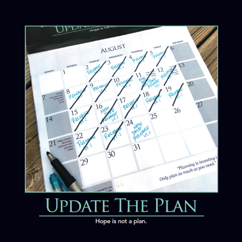

When you miss a deadline or milestone, don't just blindly shift the planned deadline back by a day. This is an opportunity to quickly re-assess the project's status, update the plan, and [communicate](/values/communication/) the new plan to all of the project's stakeholders. Remember, "Hope is not a plan." Though huge investments in planning may be overkill, some degree of forethought can go a long way. "Failure to plan is planning to fail."

## References

2016 Software Craftsmanship Calendar
