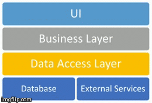

Software systems often are broken up into a series of layers. Typically, these are drawn as horizontal boxes, such as in the diagram shown here, and represent different logical components of the system. There is value in separating an application into such layers, as it provides [Separation of Concerns](/principles/separation-of-concerns/) , reducing complexity and duplication within the application.

When developing a layered software application, especially at the start of the project, there are generally two approaches. One can build horizontal layers one by one, typically starting with the lowest level since each higher layer will depend on the layers below it. For instance, the system's data can first be represented as a database schema. Next, a set of data access functions can be written to access this data. Then, a business or service layer can be added, adding additional functionality. Finally, the user interface can be created. At each step, the developers may choose to build (hopefully) reusable libraries, components, or widgets. The horizontal approach isn't always bottom-up - it can also be done starting with the user interface and working down - but this is much less common.

Alternately, developers can build individual features that span all of the layers as _vertical slices_ through the system. When following this approach, only the minimal functionality required for an individual feature or user story is built into each layer. For instance, if one of the first requirements for the system is that a user register and be authenticated, the initial system may consist of a single registration screen, a service of some kind that handles saving user information, and a database that stores the data. As additional features are added, like login and emailing forgotten passwords, the necessary functionality to support each feature is added to each layer, with any refactoring required to provide reuse or encapsulate behavior into widgets or reusable components done only when duplication is discovered (following the [DRY principle](/principles/dont-repeat-yourself/)).

The benefit of building software as a series of vertical slices is that customers are able to interact with fully functional software much sooner, and assumptions about the system's architecture and infrastructure are tested much earlier.

## Quotes

https://twitter.com/ardalis/status/312570148504629249

https://twitter.com/jbogard/status/342344297854685184

## References

[Vertical Slices (Wikipedia)](http://en.wikipedia.org/wiki/Vertical_slice)

[I'll get to your application in a minute; first we need to build a framework](http://jeffreypalermo.com/blog/i-ll-get-to-your-application-in-a-minute-first-we-need-to-build-the-framework/) - Jeffrey Palermo

[Stories Too Big - Prefer Vertical Slices](https://ardalis.com/stories-too-big-%E2%80%93-vertical-slices/) - Steve Smith

2016 Software Craftsmanship Calendar
