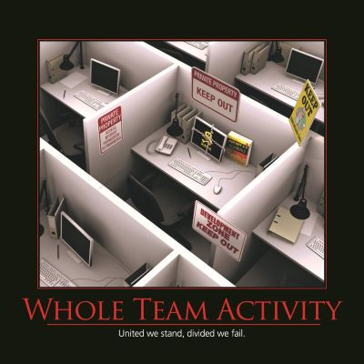

Software development is a _whole team activity_ - avoid silos and barriers to communication.  Extreme Programming introduced the idea of the [Whole Team](https://ronjeffries.com/xprog/what-is-extreme-programming/), which includes business representatives, testers, and of course programmers.  These teams work together, ideally within the same team room, in order to maximize communication and knowledge transfer within the team.  Rather than having an external "customer" toss a list of requirements to the developers, who build what they think is meant by them, and then further tossing the results "over the wall" to the testing team, involve everybody in the process continuously.  Software development is all about converting knowledge into working software, and lengthy feedback loops are a massive source of waste and bugs in software development.  By reducing feedback loops and avoiding blocking conditions in the development process (e.g. "I can't touch that code, Bob will have to look at it when he gets back from vacation." or "It's ready, but we have to wait for the QA department to do their thing before we can show it to the customer").

## Quotes

"Software development is a team sport." - [Steve Smith](https://ardalis.com/)

## See Also

[Collective Code Ownership](/practices/collective-code-ownership)

[Whole Team](/src/docs/practices/whole-team.md)

## References

[What is Extreme Programming?](https://ronjeffries.com/xprog/what-is-extreme-programming/)

Featured in the 2013 Software Craftsmanship Motivational Wall Calendar
