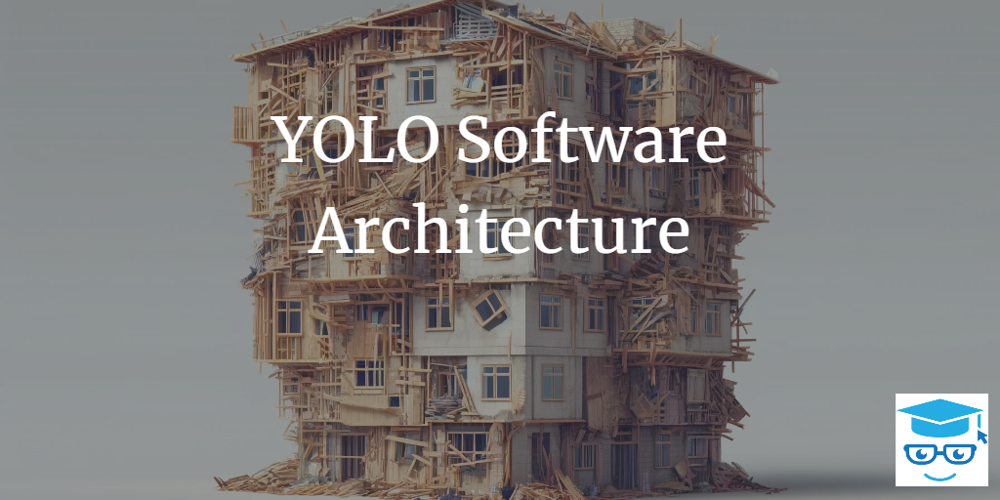

# YOLO Architecture in Software Development

In the software development world, various architectural patterns guide developers in organizing their code bases efficiently. Popular frameworks such as Clean Architecture and Vertical Slice Architecture offer structured approaches to system design. However, not all systems follow these well-defined patterns. Some systems exhibit a chaotic, unstructured approach to development: **YOLO Architecture**. This term, a play on the popular phrase "You Only Live Once," highlights the reckless, ad-hoc nature of such systems.

## What is YOLO Architecture?

YOLO Architecture describes a development style characterized by minimal planning, lack of organization, and an absence of clear architectural principles. It's a state where code is written with little regard for maintainability, scalability, or future-proofing. This approach often begins in small projects or startups where rapid development and quick results are prioritized over long-term code quality.

The term comes from YOLO, the [definition](https://www.dictionary.com/browse/yolo) of which says *used especially to rationalize impulsive or reckless behavior* and was first coined by [ardalis](https://ardalis.com).

### Characteristics of YOLO Architecture

1. **Lack of Modularity**: Code is often monolithic, with minimal separation of concerns. Functions and classes are added wherever convenient, often leading to tightly coupled components.

2. **Poor Documentation**: Little to no effort is made to document code. Developers rely on tribal knowledge, making it difficult for new team members to understand the system.

3. **Ad-Hoc Decision Making**: Architectural decisions are made on the fly without thorough (or sometimes any) consideration of long-term consequences. Short-term fixes and workarounds are the norm.

4. **High Technical Debt**: Quick fixes and shortcuts accumulate, leading to a high level of technical debt that becomes increasingly difficult to manage over time.

5. **Reactive Development**: Development is reactive rather than proactive. Changes are often driven by immediate needs or issues, rather than a coherent roadmap or strategic plan. The larger the system gets, the more often small changes result in a cascade of related issues that must be addressed. Productivity plummets.

### The Path to a Big Ball of Mud

YOLO Architecture is often a precursor to the [Big Ball of Mud (BBoM) pattern](../antipatterns/big-ball-of-mud/). The Big Ball of Mud is a system with a haphazard structure, where the codebase has grown uncontrollably and become difficult to maintain. YOLO Architecture represents the early stages of this evolution:

1. **Initial Development**: In the early stages, YOLO Architecture might seem manageable. The codebase is small, and changes can be made quickly without significant immediate repercussions.

2. **Rapid Growth**: As the system grows, the lack of structure becomes a liability. New features are harder to integrate, and bugs become more frequent and harder to track down.

3. **Scaling Issues**: The system struggles to scale. Performance issues arise, and the architecture's weaknesses become increasingly, often glaringly, apparent.

4. **BBoM Emergence**: Over time, the system reaches a tipping point where the accumulated technical debt and lack of organization result in a BBoM. At this stage, the system is nearly impossible to refactor without significant effort and risk.

### Avoiding YOLO Architecture

To prevent a project from devolving into a Big Ball of Mud, it's crucial to establish *some kind* of solid architectural foundation relatively early on (though not necessarily on day one):

1. **Planning and Design**: Invest time in planning and designing the system architecture. Consider future scalability and maintainability.

2. **Modularity**: Structure the codebase into well-defined modules or layers, adhering to principles like [SOLID](../principles/solid/), [Separation of Concerns](../principles/separation-of-concerns/), and delivering software features as [Vertical Slices](../practices/vertical-slices/)

3. **Documentation**: Maintain comprehensive documentation to ensure that the knowledge is not siloed and new developers can get up to speed quickly. Document architectural decisions using [decision records](https://ardalis.com/getting-started-with-architecture-decision-records/).

4. **Code Reviews**: Implement a rigorous code review process to catch potential architectural issues early and enforce coding standards. Use automated tools (linters, architecture unit tests, etc.) to automate this process and reduce the need to address such things during reviews.

5. **Continuous Refactoring**: Regularly [refactor](../practices/refactoring/) the codebase to address technical debt and improve the system's structure.

### Conclusion

YOLO Architecture serves as a cautionary tale for software developers. While it might seem like a quick way to get a project off the ground, the long-term consequences can be detrimental. By recognizing the signs of YOLO Architecture and taking proactive steps to avoid it, teams can build systems that are robust, maintainable, and scalable.

## References

1. [The Big Ball of Mud](../antipatterns/big-ball-of-mud/)
2. [SOLID Principles](../principles/solid/)
3. [Clean Architecture](https://ardalis.com/clean-architecture-asp-net-core/)
4. [Vertical Slice Architecture](https://jimmybogard.com/vertical-slice-architecture/)
5. [Architecture by Implication](../antipatterns/architecture-by-implication/)
