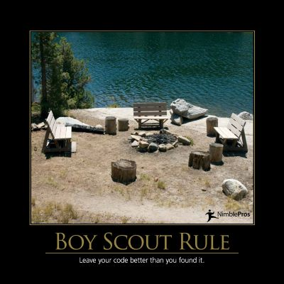

The Boy Scout Rule can be summarized as:

_**Leave your code better than you found it.**_

Boy Scouts have a rule regarding camping, that they should leave the campground cleaner than they found it. They don't take it upon themselves to ensure the entire campground is cleaned up, but neither do they simply trash the place but plan on coming back one week out of the year to do a proper cleanup job. By ensuring that the campground is cleaner when they leave than it was when they arrived, they can guarantee that they are doing no harm, at least when it comes to the cleanliness of the site.

In software, keeping code clean is a constant challenge, and developers and software teams must decide if, when, and how they will go about maintaining the cleanliness of their code. When does it make sense to spend time working to improve the design of the codebase? Over time, the quality of the underlying source code of a system tends to degrade, accumulating [technical debt](/terms/technical-debt). Paying down this debt via refactoring is necessary in order to keep the code in a state where it is economical to extend and maintain it. Some teams take the approach of shutting down all value-adding work and simply trying to clean up the codebase for a week or a month or some other period of time. The Boy Scout Rule suggests an alternative approach, which is to simply try and ensure that with each commit, you leave the code better than you found it.  Maybe only slightly. Following this principle, teams can improve the quality of their code over time, while continuing to deliver value to their customers and stakeholders.

## Quotes

The act of leaving a mess in the code should be as socially unacceptable as _littering_. -- Robert C. "Uncle Bob" Martin

## References

2016 Software Craftsmanship Calendar

[Refactoring Fundamentals](https://www.pluralsight.com/courses/refactoring-fundamentals) (on Pluralsight)

## Previous Images

This principle was featured in the 2011 Software Craftsmanship Calendar using the image below, as well as the 2016 Software Craftsmanship Calendar (with image above).

