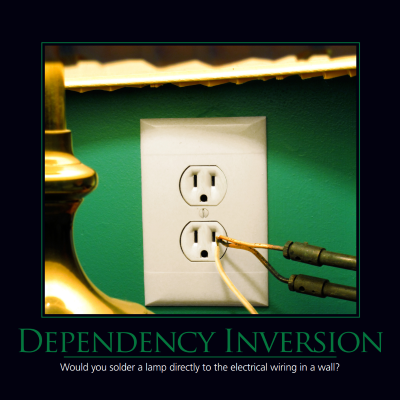

The Dependency Inversion Principle (DIP) states that _**high level modules should not depend on low level modules; both should depend on abstractions. Abstractions should not depend on details.  Details should depend upon abstractions**_. It's extremely common when writing software to implement it such that each module or method specifically refers to its collaborators, which does the same. This type of programming typically lacks sufficient layers of abstraction, and results in a very tightly coupled system, since every module is directly referencing lower level modules.

**Example 1**

Consider a user interface form with a button. When the button is clicked, an event is fired. Within the event, a new instance of a Business Logic Layer (BLL) class is created, and one of its methods is called. Within the BLL class's method, a new instance of a Data Access Layer (DAL) class is created, and one of its methods is called. This method in turn makes a database query.

The result of this approach is that everything in the system is tightly coupled to the database.  The dependency tree goes UI -> BLL -> DAL -> DB, and these dependencies are transitive. These classes and methods are all tightly coupled together because of the direct instantiation that is occurring (Remember: [New is Glue](http://ardalis.com/new-is-glue)), though you will also see this behavior if you use static method calls. The way to correct this design problem is to apply the Dependency Inversion Principle, which typically begins with the introduction of new interfaces.

**Example 2**

Consider a user interface form with a button. When the button is clicked, an event is fired. In response to the event, a private member of the form, whose type is simply an interface, has one of its methods called. The 'new' keyword is nowhere to be found in the click event handler. The implementation of the interface is provided when the form is created, through a process known as [Dependency Injection](/practices/dependency-injection). Likewise, if this method is providing key business logic, but also requires access to the system's persistence layer, it, too may specify (explicitly in its constructor) one or more interfaces that it depends on, which may include implementations of the Repository pattern. No static method calls or 'new' keywords will exist in the business logic class's method, either.

[Shifting from traditional, data-centric N-Tier architecture to a more domain-centric N-Tier architecture](http://www.pluralsight.com/courses/n-tier-apps-part1) and potentially to the full application of [Domain-Driven Design](http://bit.ly/PS-DDD) can yield great maintainability benefits for projects. The end result is a system that is loosely coupled, modular, and easily tested.

## See Also

[Explicit Dependencies Principle](/principles/explicit-dependencies-principle)

[Hollywood Principle](/principles/hollywood-principle)

## References

[New is Glue](http://ardalis.com/new-is-glue)

[Architecting N-Tier Solutions in C#](http://www.pluralsight.com/courses/n-tier-apps-part1) (Pluralsight)

[SOLID Principles of Object Oriented Design](https://www.pluralsight.com/courses/principles-oo-design) (Pluralsight)

[Domain-Driven Design Fundamentals](http://bit.ly/PS-DDD) (Pluralsight)
