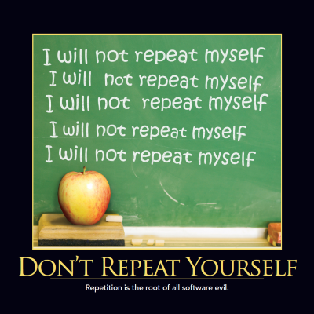
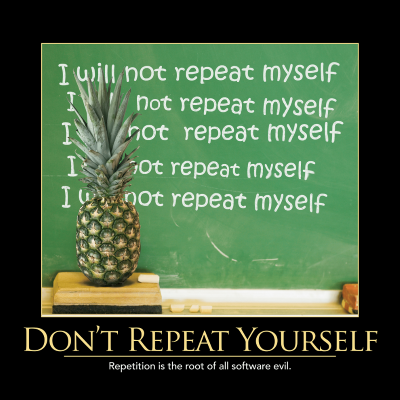

The Don't Repeat Yourself (DRY) principle states that duplication in logic should be eliminated via abstraction; duplication in process should be eliminated via automation. _**Duplication is Waste**_. Adding additional, unnecessary code to a codebase increases the amount of work required to extend and maintain the software in the future.  Duplicate code adds to technical debt.  Whether the duplication stems from [Copy Paste Programming](/antipatterns/copy-paste-programming) or poor understanding of how to apply abstraction, it decreases the quality of the code.  Duplication in process is also waste if it can be automated.  Manual testing, manual build and integration processes, etc. should all be eliminated whenever possible through the use of automation.

## Suspect Conditionals

Often, if-then and switch statements have a habit of being duplicated in multiple places within an application.  It's common in secured applications to have different functionality available to users in certain roles, so the code may be littered with if-user-is-in-role checks.  Other applications may have been extended to deal with several similar but distinct kinds of data structures, with switch() statements at all levels of the workflow used to describe the differences in behavior each data structure should have.  Wherever possible, refactor these conditionals using well-known design patterns to abstract the duplication into a single location within the codebase.

## See Also

[Once and Only Once](once-and-only-once.md) can be considered a subset of the DRY principle.

The [Open/Closed Principle](/principles/open-closed-principle) only works when DRY is followed.

The [Single Responsibility Principle](/principles/single-responsibility-principle) relies on DRY.

## References

[SOLID Principles of Object Oriented Design on Pluralsight](https://www.pluralsight.com/courses/principles-oo-design) (includes 2 modules on DRY)

Don't Repeat Yourself from [97 Things Every Programmer Should Know](http://amzn.to/z5LNUC)

2016 Software Craftsmanship Calendar
