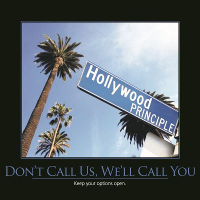

The Hollywood Principle states, "Don't Call Us, We'll Call You." It's closely related to the [Dependency Inversion Principle](/principles/dependency-inversion-principle), and illustrates a different way of writing software from the more traditional form of programming in which one's own code dictates the flow of control.  When following the Hollywood Principle, code is written to respond to external events, such as from an existing framework.

By way of an example, a typical ASP.NET Web Form might have in its codebehind page event handlers to respond to Page_Load and Button_Click events.  An ASP.NET developer writes code to respond to these external framework events, instead of owning the execution of the web server and making all decisions and method calls accordingly.  Plug-in and extension models for applications frequently must take advantage of the Hollywood Principle in their design, exposing events and similar "hooks" for plug-in modules to use, allowing the overall program to call into the plug-in whenever needed, while avoiding the having the plug-in code take over control of the execution of the entire application.

## See Also

[Dependency Inversion Principle](/principles/dependency-inversion-principle)

## References

[Inversion of Control](http://martinfowler.com/bliki/InversionOfControl.html) by Martin Fowler

2013 Software Craftsmanship Calendar
