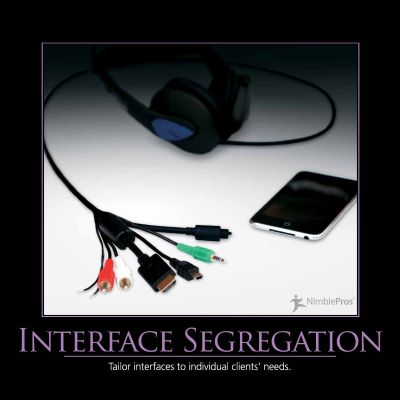

The Interface Segregation Principle (ISP) states that clients should not be forced to depend on methods that they do not use.  Interfaces should belong to clients, not to libraries or hierarchies. Application developers should favor thin, focused interfaces to "fat" interfaces that offer more functionality than a particular class or method needs.

In many languages, such as C#, interfaces can inherit from multiple other interfaces. Thus, if you need a larger interface in some parts of the application, but not in others, you may be able to compose it from two or more other interfaces. This is also a good approach to keep in mind if you find yourself refactoring a legacy codebase, which already has large interfaces that you can't break. Consider an interface like this one:

```java lineNumbers=true
public interface IMembership
{
  bool Login(string username, string password);
  void Logout(string username);
  Guid Register(string username, string password, string email);
  void ForgotPassword(string username);
}
```

It's easy to [imagine such an interface growing completely out of control and having more functionality than any one class would ever require](https://msdn.microsoft.com/en-us/library/system.web.security.membershipprovider(v=vs.110).aspx). To keep, say, a login form from having more methods on it than it needs, you could create a login-specific interface, and have the existing interface extend from it:

```java lineNumbers=true
public interface ILogin
{
  bool Login(string username, string password);
  void Logout(string username);
}

public interface IMembership : ILogin
{
  Guid Register(string username, string password, string email);
  void ForgotPassword(string username);
}
```

Of course, you can extend this further, as required, perhaps ending up with an original "fat" interface that only exists for legacy reasons, and is totally composed of other interfaces:

```java lineNumbers=true
public interface ILogin
{
  bool Login(string username, string password);
  void Logout(string username);
}
public interface IRegister
{
  Guid Register(string username, string password, string email);
}
public interface IForgotPassword
{
  void ForgotPassword(string username);
}

public interface IMembership : ILogin, IRegister, IForgotPassword
{
}
```

Ideally, your thin interfaces should be _cohesive_, meaning they have groups of operations that logically belong together. This will prevent you from ending up with one-interface-per-method most of the time in real-world systems (as opposed to the above trivial example).

Another benefit of smaller interfaces is that they are easier to implement fully, and thus less likely to break the [Liskov Substitution Principle](/principles/liskov-substitution-principle/) by being only partially implemented. They also provide greater flexibility in how you implement functionality, since parts of a larger interface can be implemented in different ways. Consider the [Repository pattern](/design-patterns/repository-pattern/), which usually includes methods for reading as well as writing. A common performance pattern for database reads it so add a caching layer, but this generally only makes sense for read operations. Likewise, scalability can often be improved by queuing commands (like write operations) rather than executing them immediately, but you wouldn't queue queries. Thus, having an IRepository interface composed of an IReadOnlyRepository and an IWriteRepository would allow base implementations that go against a data store and separate implementations that employ caching and queuing, as well.

## See Also

[SOLID Principles Overview](/principles/solid/)

## References

[SOLID Principles of Object Oriented Design](http://bit.ly/solid-smith) - Course on Pluralsight
