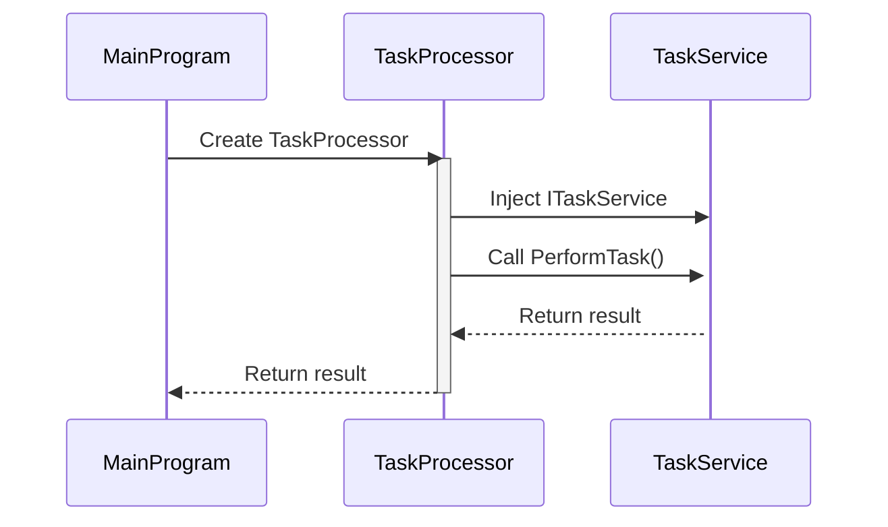

Inversion of Control (IoC or IOC) describes a system that follows the [Hollywood Principle](/principles/hollywood-principle/). That is, flow of control within the application is not controlled by the application itself, but rather by the underlying framework. Typically in such an architecture, the application is written such that it ties into the application framework by handling framework events or plugging in to framework extension points.

An IoC Container, also known as a [Dependency Inversion (DI)](/principles/dependency-inversion-principle/) container, is a specialized factory used to facilitate [dependency injection](/practices/dependency-injection/).

## Code Example for IoC

For this concept, let's look at a hypothetical task processor and task service. The task processor (`TaskProcessor`) will get called in the main application to perform a task. Then, it will get an injected implementation of the interface, and it will call the `PerformTask()` on the injected implementation. The task processor doesn't have a specific implementation in its code - it just knows that it needs an implementation that fulfills a specific interface. The main application is responsible for injecting in the specific implementation.

### The Flow of IoC

Let's look at this situation with a sequence diagram.

In this sequence diagram:

1. `MainProgram` is the starting participant that creates an instance of `TaskProcessor`.
2. `TaskProcessor` is activated, indicating that it is in the process of being executed.
3. `TaskProcessor` then injects an instance of `ITaskService` into itself, provided by `MainProgram`. In this example, it could be an instance of `TaskService`.
4. `TaskProcessor` calls the `PerformTask()` method on the injected `ITaskService`.
5. `TaskService` is activated to execute the `PerformTask()` method.
6. `TaskService` returns the result to `TaskProcessor`.
7. Finally, `TaskProcessor` returns the result to `MainProgram`, and it is deactivated.

This is the sequence diagram:



## Code Sample of IoC

This is a sample of what inversion of control could look like using C#.


In this example:

- `ITaskService` is an interface representing a service with a `PerformTask()` method.
- `TaskService` is a concrete implementation of `ITaskService`.
- `TaskProcessor` is a class that depends on `ITaskService`. Instead of creating an instance of `TaskService` within `TaskProcessor`, it receives an instance of `ITaskService` through constructor injection.
- In the `Main()` method, an instance of `TaskService` is created and passed to the constructor of TaskProcessor. The control flow is inverted because TaskProcessor doesn't create or manage its dependencies; they are injected from the outside.


```csharp
// Service interface
public interface ITaskService
{
    string PerformTask();
}

// Concrete implementation of the service
public class TaskService : ITaskService
{
    public string PerformTask()
    {
        // Task logic here
        return "Task completed";
    }
}

// Class that depends on ITaskService
public class TaskProcessor
{
    private readonly ITaskService taskService;

    // Constructor injection of the dependency
    public TaskProcessor(ITaskService taskService)
    {
        this.taskService = taskService;
    }

    public string ProcessTask()
    {
        // Using the injected dependency
        return taskService.PerformTask();
    }
}

// Main program
class Program
{
    static void Main()
    {
        // Setting up the IoC container (dependency injection container)
        // In a real-world scenario, you might use a more robust IoC container like Autofac, Unity, etc.
        ITaskService taskService = new TaskService();
        TaskProcessor taskProcessor = new TaskProcessor(taskService);

        // Using the TaskProcessor without worrying about creating its dependencies
        string result = taskProcessor.ProcessTask();
        Console.WriteLine(result);
    }
}
```

## See Also

[Hollywood Principle](/principles/hollywood-principle/)

## References

[Inversion of Control](https://en.wikipedia.org/wiki/Inversion_of_control) (Wikipedia)

[Comparing Major C# IOC Containers](http://stackoverflow.com/questions/4581791/how-do-the-major-c-sharp-di-ioc-frameworks-compare)
