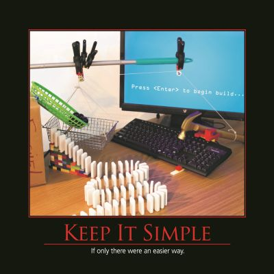

The KISS principle, or _**Keep It Simple, Stupid**_, spans many trades, industries, and professions. The more complex something is, the more ways there are for it to fail, and the more difficult it is to explain to someone else who needs to understand it.  When building software, an incremental approach that keeps things as simple as possible for as long as possible tends to yield working software with fewer defects, faster.  One way to minimize the amount of bugs in an application is to maximize the number of lines of code that aren't written, and avoiding needless complexity is a sure way to help achieve this goal.  It's also important to remember, when debating whether some complexity might be worthwhile, that many times [You Aren't Gonna Need It](/principles/yagni).  If we write our software such that it is flexible, we can add new functionality later when it's needed.  To this end, simple software tends to be more malleable than complex software.

## Quotes

"Everything should be made as simple as possible, but no simpler." -- Albert Einstein

"Simplicity is the ultimate sophistication." -- Leonardo do Vinci

"Nature is pleased with simplicty. And nature is no dummy" -- Isaac Newton

"The Lazy Programmer does not use 'clever' code because everyone who ever reads it or tries to change it will have to be just as clever, every time." -- [RichardCHaven](http://c2.com/cgi/wiki?DoSimpleThings)

## See Also

[You Ain't Gonna Need It (YAGNI)](/principles/yagni)

## References

[Do The Simplest Thing That Could Possibly Work (XP)](http://c2.com/xp/DoTheSimplestThingThatCouldPossiblyWork.html)

[The KISS Principle](http://en.wikipedia.org/wiki/KISS_principle) - On Wikipedia
