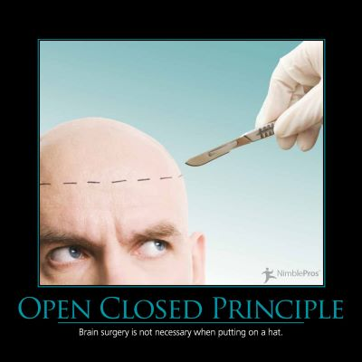

The Open-Closed Principle (OCP) states that software entities (classes, modules, methods, etc.) should be open for extension, but closed for modification.

In practice, this means creating software entities whose behavior can be changed without the need to edit and recompile the code itself. The simplest way to demonstrate this principle is to consider a method that does one thing. Let's say it writes to a particular file, the name of which is hard-coded into the method. If the requirements change, and the filename now needs to be different in certain situations, we must open up the method to change the filename. If, on the other hand, the filename had been passed in as a parameter, we would be able to modify the behavior of this method without changing its source, keeping it closed to modification.

The Open-Closed Principle can also be achieved in many other ways, including through the use of inheritance or through compositional design patterns like the [Strategy pattern](/design-patterns/strategy-pattern).

## Quotes

https://twitter.com/hashtag/ccoz09?src=hash

https://twitter.com/Hamman359/status/48772493363781632

## See Also

[Strategy Design Pattern](/design-patterns/strategy-pattern)

[SOLID Principles](/principles/solid)

## References

[SOLID Principles of Object Oriented Design](https://www.pluralsight.com/courses/principles-oo-design) - Pluralsight - Steve Smith

[Principles, Patterns, and Practices of Agile Software Development](http://amzn.to/1cu7La6) - Amazon

[Principles, Patterns, and Practices of Agile Software Development in C#](http://amzn.to/RiNdCs) - Amazon
