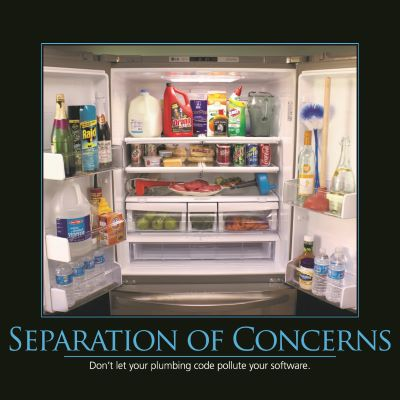

A key principle of software development and architecture is the notion of _separation of concerns_.  At a low level, this principle is closely related to the [Single Responsibility Principle](/principles/single-responsibility-principle) of object oriented programming.  The general idea is that one should avoid co-locating different concerns within the design or code.  For instance, if your application includes business logic for identifying certain noteworthy items to display to the user, and your application formats such items in a certain way to make them more noticeable, it would violate separation of concerns if both the logic for determining which items were noteworthy and the formatting of these items were in the same place.  The design would be more maintainable, less tightly coupled, and less likely to violate the [Don't Repeat Yourself principle](/principles/dont-repeat-yourself) if the logic for determining which items needed formatted were located in a single location (with other business logic), and were exposed to the user interface code responsible for formatting simply as a property.

At an architectural level, separation of concerns is a key component of building layered applications.  In a traditional N-tier application structure, layers might include data access, business logic, and user interface.  More modern N-tier application designs might include a core domain model and separate infrastructure modules in addition to one or more front end services and/or user interfaces.  Web pages, to a greater or lesser degree, separate concerns relating to structure, logic, and formatting through the use of HTML, JavaScript, and CSS.  At a lower level, [the networking model used by the Internet](http://en.wikipedia.org/wiki/OSI_model) is broken into a series of layers each with specific concerns and responsibilities, and demonstrates how separation of concerns can be effectively applied.

In addition to separating logic across programming layers, one can also separate concerns along application feature sets.  Applications may be written to allow functionality to be added or removed in a modular fashion, and many commercial products support this functionality as a means of separating features across product SKUs or to allow third parties to create plug-ins.

Separation of Concerns tends to be a natural consequence of following the Don't Repeat Yourself principle, since of necessity abstractions must be built to encapsulate concepts that would otherwise be repeated throughout the application.  As long as these abstractions are logically grouped and organized, then Separation of Concerns should be achieved.

## Quotes

"\[Separation of Concerns\], even if not perfectly possible, is yet the only available technique for effective ordering of one's thoughts, that I know of." -- Edsger W. Dijkstra

## See Also

[Single Responsibility Principle](/principles/single-responsibility-principle)

[Don't Repeat Yourself](/principles/dont-repeat-yourself)

## References

[Principles of Object Oriented Design](https://www.pluralsight.com/courses/principles-oo-design) from Pluralsight

[Creating N-Tier Applications in C#, Part 1](http://www.pluralsight.com/courses/n-tier-apps-part1) from Pluralsight

[Creating N-Tier Applications in C#, Part 2](https://www.pluralsight.com/courses/n-tier-csharp-part2) from Pluralsight

An excellent article on [Separation of Concerns](http://aspiringcraftsman.com/2008/01/03/art-of-separation-of-concerns/)

[Separation of Concerns](http://en.wikipedia.org/wiki/Separation_of_concerns) on Wikipedia
