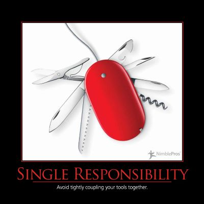

The Single Responsibility Principle (SRP) states that a class should have only one reason to change.  It was first cited in this form by Robert C. Martin in an article that later formed a chapter in his [Principles, Patterns, and Practices of Agile Software Development](http://amzn.to/1cu7La6) book.

The Single Responsibility Principle is closely related to the concepts of coupling and cohesion.  Coupling refers to how inextricably linked different aspects of an application are, while cohesion refers to how closely related the contents of a particular class or package may be.  All of the contents of a single class are tightly coupled together, since the class itself is a single unit that must either be entirely used or not at all (discounting static methods and data for the moment).  When other classes make use of a particular class, and that class changes, the depending classes must be tested to ensure they continue to function correctly with the new behavior of the class.  If a class has poor cohesion, some part of it may change that only certain depending classes utilize, while the rest of it may remain unchanged.  Nonetheless, classes that depend on the class must all be retested as a result of the change, increasing the total surface area of the application that is affected by the change.  If instead the class were broken up into several, highly cohesive classes, each would be used by fewer other elements of the system, and so a change to any one of them would have a lesser impact on the total system.

Martin suggests that we define each responsibility of a class as _a reason for change_.  If you can think of more than one motivation for changing a class, it probably has more than one responsibility.  When these axes of change occur, the class will probably need to have different aspects of its behavior changed, at different times and for different reasons.  However, like other principles, it's unwise to try and apply SRP to everything from the outset.  If a particular class is stable and isn't causing needless pain as a result of changes, there is little need to change it. Practice [Pain Driven Development](/practices/pain-driven-development).

Some examples of responsibilities to consider that may need to be separated include:

- Persistence
- Validation
- Notification
- Error Handling
- Logging
- Class Selection / Instantiation
- Formatting
- Parsing
- Mapping

## Quotes

https://twitter.com/skonnard/status/24126256458

https://twitter.com/Hamman359/status/48772493363781632

https://twitter.com/keburnell/status/50898826168516608

https://twitter.com/venkat_s/status/123038464332673024

https://twitter.com/hotgazpacho/status/127000772847222785

https://twitter.com/mfeathers/status/359703449920733184

## See Also

[SOLID](/principles/solid)

## References

[Single Responsibility Principle](http://en.wikipedia.org/wiki/Single_responsibility_principle) (Wikipedia)

[SOLID Principles of Object Oriented Design](https://www.pluralsight.com/courses/principles-oo-design) - Pluralsight - Steve Smith

[Principles, Patterns, and Practices of Agile Software Development](http://amzn.to/1cu7La6) - Amazon

[Principles, Patterns, and Practices of Agile Software Development in C#](http://amzn.to/RiNdCs) - Amazon
