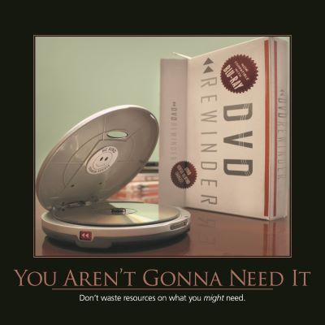

YAGNI, or "You Ain't Gonna Need It" (or "You Aren't Gonna Need It"), emerged as one of the key principles of Extreme Programming.  Put another way, the principle states:

"Always implement things when you _**actually**_ need them, never when you just _**foresee**_ that you _**may**_ need them."

There are a number of reasons why this principle exists.  Firstly, it maximizes the amount of unnecessary work that is left undone, which is a great way to improve developer productivity and product simplicity.  Remember, features are expensive, both to develop and maintain, and for users to learn and navigate around.  Features that aren't actually necessary are a huge source of waste.

In some ways, you can think of YAGNI as being similar to Just-In-Time manufacturing.  Rather than ordering a bunch of parts based on what you think you might need, wait for actual customer orders and ensure your process is lean enough that you can pull orders through you supply chain quickly enough to satisfy your customers.  Now, just as JIT only works well in manufacturing organizations that are disciplined enough to follow lean principles, the case can be made that YAGNI works best in environments that ensure their code is kept in a malleable, changeable state.  If, in the future, adding new functionality will be difficult because the code has turned into a steaming pile of Spaghetti Code, then you might be able to argue that adding the feature before the code gets to that state would be a good practice.

It follows that YAGNI is closely related to te Keep It Simple, Stupid principle.  By avoiding adding features and complexity until it's actually needed, the overall design of the system can remain simpler, longer.  And that feature you thought you would need?  Well, usually it it turns out that you either didn't actually need it, or that when you do need it, your understanding of how best to design it will be better than if you'd tried to divine how it would be used earlier in the project.

## Quotes

"Every line of code we _don't_ write is dollars we _didn't_ spend, and time on the calendar we get back for free." - Tim Evans-Ariyeh

"The cheapest, fastest, and most reliable components of a computer system are those that aren't there." - Gordon Bell

## See Also

[Keep It Simple, Stupid (KISS)](/principles/keep-it-simple)

## References

[You Arent Gonna Need It (C2 XP Wiki)](http://c2.com/xp/YouArentGonnaNeedIt.html)

Featured in the 2016 Software Craftsmanship Calendar

Featured in the 2013 Software Craftsmanship Motivational Wall Calendar (DVD image)
