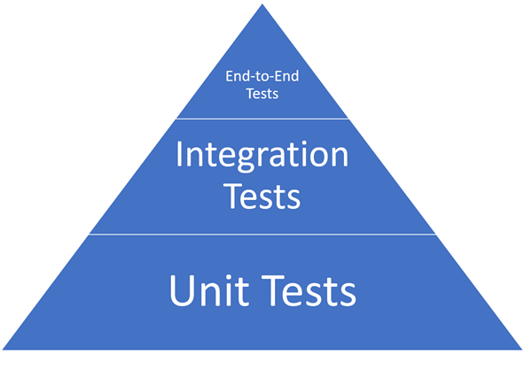

The testing pyramid is a framework that guides the distribution of different types of tests in a software development project. It emphasizes having more low-level tests (like unit tests) and fewer high-level tests (like end-to-end tests) to create a stable, efficient testing process.

## Unit Tests Layer

The [unit tests](/testing/unit-tests) layer forms the base of the pyramid and consists of tests that verify the smallest pieces of code, like individual functions or methods. Unit tests are fast, easy to write, and provide immediate feedback on the correctness of code.

## Integration Tests Layer

Above the unit tests, [integration tests](/testing/integration-tests) focus on testing interactions between different parts of the system. These tests ensure that components or services work together as expected. Integration tests are more complex and slower than unit tests but cover more significant parts of the application.

## End-to-End Tests Layer

At the top of the pyramid are end-to-end tests, which simulate real user scenarios and validate the entire application from start to finish. These tests are the most complex and slowest to run, so they are generally fewer in number but provide high confidence in the system’s overall functionality.

## Conclusion

These are the core types of tests commonly represented in the testing pyramid. However, these are not the only types of tests. There are others that are between layers or to the side - such as [front-end tests](/testing/front-end/tests) and [functional tests](/testing/functional-tests).

## See Also

- [Design Patterns for Testing](https://www.youtube.com/watch?v=kB1bb7q7f0A)