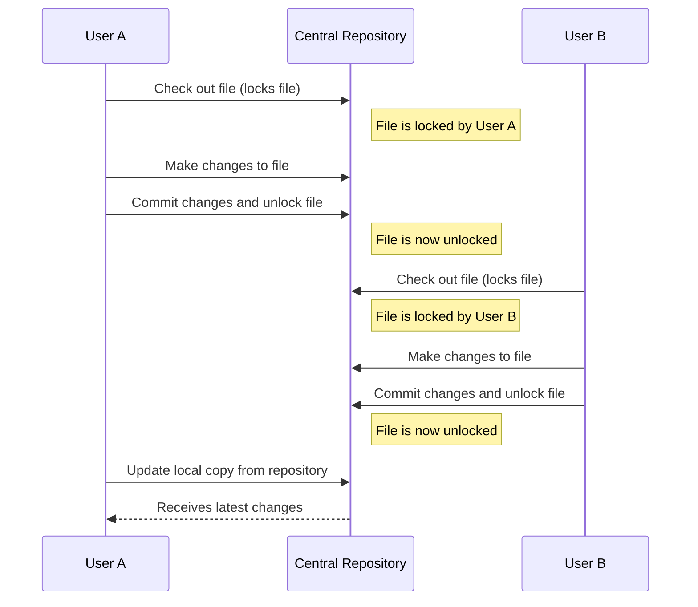
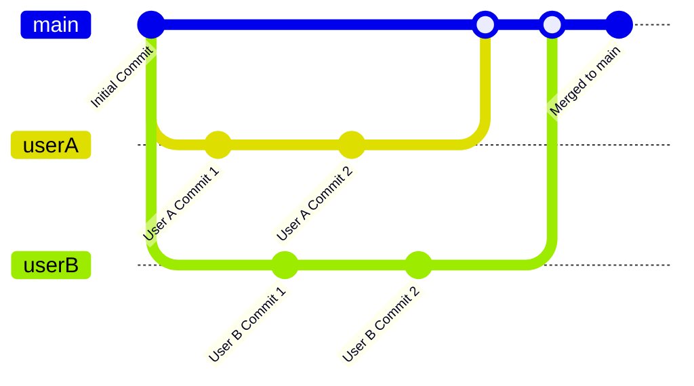
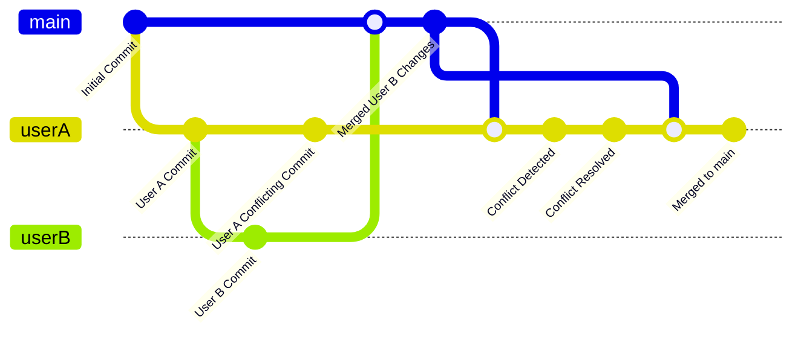

Version or source control is one of the most fundamental tools available for software development.  Even if the only editor you have is a simple text editor and your only compiler is a command line tool, a proper revision control system can offer huge benefits.  Historically, most version control systems maintained a single repository that all team members would check code out from and commit changes back to.  Some of these systems implemented a locking mechanism that would attempt to ensure that no two team members had checked out a file for modification at the same time, while others allowed for multiple concurrent changes but required changes to be merged when checked in if conflicts were found. Distributed version control systems (DVCS) have taken over in popularity, with centralized version control systems (CVCS) falling out of popularity.  With a DVCS, every team member has a complete repository with all history, and all checkins are done locally first, and then periodically merged up into one or more central reference repositories.

## Conflict Management, Locking, and Merging

One issue every version control system must contend with is how to handle conflicts. For instance, if two users edit the same file and then each commit it to the version control system, what happens? 

Generally, there are two approaches to solving this issue: locking and merging. All version control systems support at least one of these options, and many support both.

### Locking

In the case of locking, a centralized VCS service will lock files as a user checks them out or modifies them, preventing other users from obtaining the rights to write to these files. As changes are committed, locks are released, and other users gain the ability to write to (and lock) the files in question.

### Merging

The other approach is to allow anybody to work on any files at any time, but for conflicts to be automatically detected when changes are committed to the system. If user A and user B both start with version 1 of a given file, and then user A commits changes to this file (updating the revision number to 2), then when user B commits their changes, the system will note that user B is committing updates to a file they retrieved as version 1 but which currently is version 2. This will trigger a merge operation. 

### Working with Merge Conflicts

For many VCS systems, the automatic merging capabilities of the system are very good, allowing for the commit to go through so long as the sections of the file that users A and B changed are different. However, if for instance both users A and B renamed a word on a particular line of the file, each to something different, there is no way for the system to automatically determine which change should be kept. In this case, the second committing user (user A) is responsible for manually merging their changes with those that exist in the current version of the file in the VCS system. Once they have indicated which change(s) should be kept and which discarded, the commit can be completed.

## Free and Popular Version Control Systems

- Git
  - GitHub
  - GitLab
  - Bitbucket
- Mercurial
- Subversion

## See Also

[Copy Folder Versioning (antipattern)](/antipatterns/copy-folder-versioning)

## References

[Wikipedia](http://en.wikipedia.org/wiki/Version_control)

[Comparison of Revision Control Systems - Wikipedia](http://en.wikipedia.org/wiki/Comparison_of_revision_control_software)
